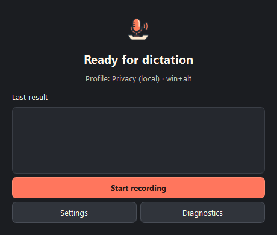
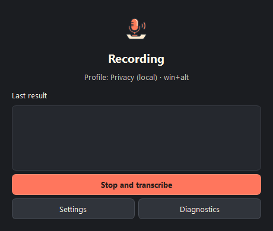
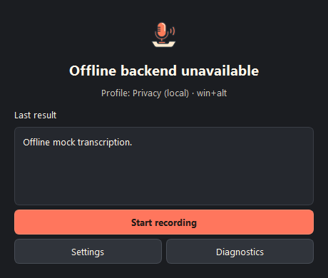

# WhisperTray

<p align="center">
  
</p>

WhisperTray is a desktop dictation app for Windows, macOS, and Linux. Press a
global shortcut, speak, and the transcript is inserted into the active app. It
supports a fully local privacy profile and an optional Groq profile that uses
your own API key.

> Release status: pre-release. Native installers are built automatically from
> version tags, but the first public release has not been published yet.

## What it does

- Records from a selected microphone with a ten-minute safety limit.
- Transcribes locally with `faster-whisper`, or through Groq when explicitly selected.
- Shows the same recording, processing, success, and error state in the window,
  overlay, and tray.
- Stores the Groq key in the operating-system credential vault, never in JSON.
- Keeps transcript history only when the user enables it.
- Transcribes individual audio and video files.

## Privacy profiles

| Profile | Audio destination | Network use | Fallback |
| --- | --- | --- | --- |
| Privacy | Local Whisper only | No transcription request leaves the device | None |
| Speed | Groq API | Audio is sent to Groq | Local fallback only when the user enables it and the local model is available |

Changing profile always requires an explicit settings change. A cloud failure
never sends audio anywhere else and never changes the privacy profile silently.

## Screens

| Ready | Recording | Error recovery |
| --- | --- | --- |
|  |  |  |

Additional verified captures are in
[`artifacts/screenshots`](artifacts/screenshots), including settings,
diagnostics, the tray menu, and every overlay state.

## Installation

Download the package for your system from GitHub Releases:

- Windows: `.msi`
- macOS: `.dmg` or `.pkg`
- Linux: the native package produced for the release runner

Windows installation creates Start menu integration through MSI. Desktop
shortcut behavior belongs to the native installer and is verified in the
release smoke checklist.

The installer cannot realistically be 20 MB. Python, Qt, the audio stack and
the transcription runtime are substantially larger before a Whisper model is
downloaded. Models are therefore downloaded on demand and are not bundled in
the installer.

### Platform permissions

- Windows: allow microphone access in Privacy settings.
- macOS: allow Microphone and Accessibility access. Accessibility permission is
  required for global shortcuts and insertion into other apps.
- Linux: microphone access must be available to the desktop session. Global
  shortcuts currently require X11; Wayland reports an explicit unsupported
  state instead of pretending the shortcut was registered.

## First run

1. Choose the Privacy or Speed profile.
2. Select the microphone and test it.
3. Choose the recognition language and global shortcut.
4. For Privacy, download the local model from Settings.
5. For Speed, enter and test your Groq key. The key is saved only after the
   credential vault accepts it.

The default profile is Privacy. Local model sizes shown in the app range from
approximately 75 MB (`tiny`) to 2.9 GB (`large`).

## Data locations

| System | Application data |
| --- | --- |
| Windows | `%LOCALAPPDATA%\WhisperTray` |
| macOS | `~/Library/Application Support/WhisperTray` |
| Linux | `$XDG_DATA_HOME/WhisperTray` or `~/.local/share/WhisperTray` |

The directory contains configuration, rotating technical logs, and optional
history. Logs do not contain transcript text, audio, or credential values.

## Development

Python 3.10 or newer is required.

```powershell
python -m venv .venv
.\.venv\Scripts\Activate.ps1
python -m pip install -r requirements-dev.txt
python main.py
```

On macOS/Linux, activate the environment with `source .venv/bin/activate`.
`requirements.txt` and `requirements-dev.txt` are complete resolved lock files
generated from their matching `.in` files with `uv pip compile`.

Run the quality gates:

```powershell
python -m pytest -q
ruff check .
python -m compileall -q .
```

The E2E suite includes a deterministic WAV pipeline. A manual real-ASR check can
be run with a local model and a generated or recorded voice sample; it must not
be confused with the offline mock test used in CI.

## Native packages and releases

The project uses Briefcase to create host-native packages. Builds must run on
the target operating system; Windows cannot produce a valid macOS or Linux
installer.

```powershell
python -m briefcase create windows --no-input
python tools/add_windows_desktop_shortcut.py
python -m briefcase build windows --no-input
python -m briefcase package windows --no-input
```

See [`docs/PACKAGING.md`](docs/PACKAGING.md) for macOS/Linux commands, signing,
release tags, and the clean-machine checklist. Pushing a tag such as `v1.0.0`
runs all three packaging jobs and publishes their artifacts to one GitHub
Release.

## Security

- Never commit `config.json`, logs, audio, transcript history, or API keys.
- Revoke a key immediately if it appears in Git history.
- Public releases require a full-history secret scan.
- Diagnostics export contains technical state only.

Security and release reports should include reproduction steps without user
audio, transcript text, or credentials.
